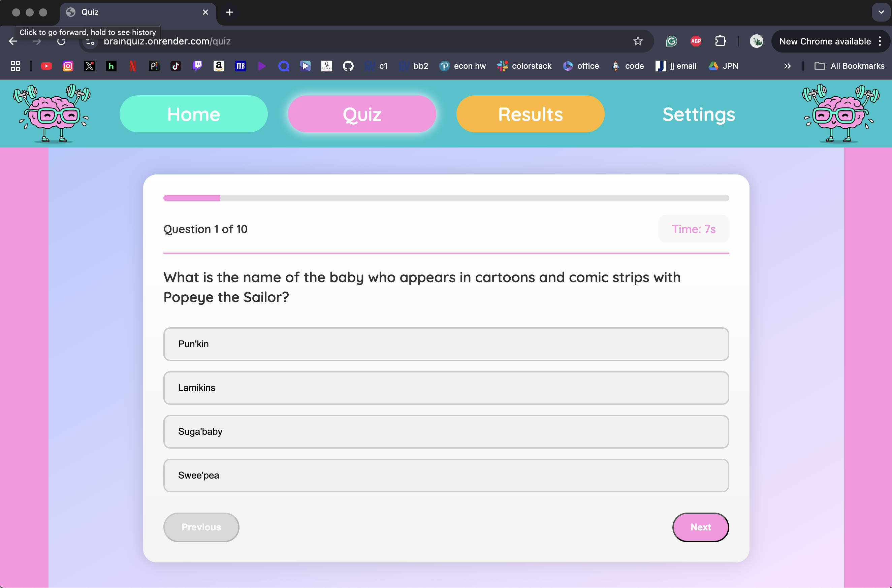
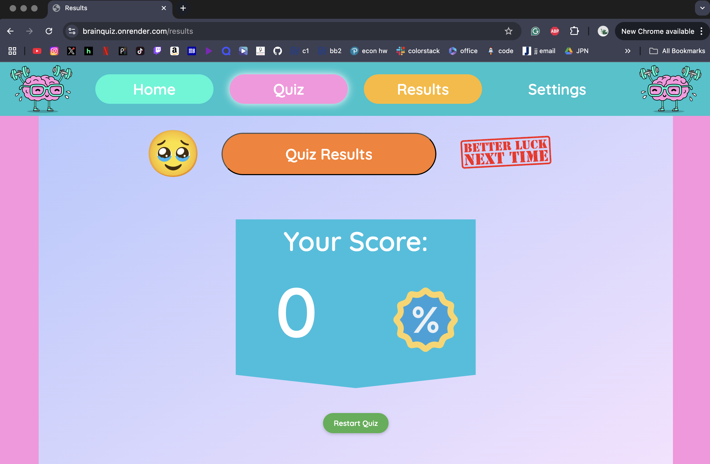

# Quiz App

A web-based Quiz Application developed collaboratively by our team as part of the course project. The app allows users to take quizzes, view results, and track performance.

---

## ✨ Features

- **Dynamic Quizzes**: Questions are randomized each time to ensure fairness and variety.
- **Theme Customization**: Toggle between light and dark mode for a personalized experience.
- **Font Control**: Choose your preferred font style to improve readability.
- **Smart Results Page**: The results page dynamically adjusts based on user score—providing customized feedback.

---

## 👩‍💻 Team Members & Roles

- *Faiza*: I worked on the HTML and CSS for the questions and results pages. Made the design layout for the loading page. Worked on the JavaScript for the settings page and the questions page. Assisted in the JavaScript for the results page. 
- *Hanya*: I worked on the HTML, CSS and JS of the settings page. I also assisted with the CSS and HTML of the results page as well and added to the Quiz and Results page's JS to apply the saved settings to there. 
- *Jude*:
- *Maira*: For this project, I was responsible for developing the homepage using CSS, EJS, and JavaScript. I also designed and implemented the transition page that appears before the questions begin. Initially, our project was built using plain HTML, CSS, and JS, so I handled the migration to Express.js by converting our codebase and setting up all the necessary routes to ensure seamless navigation between pages.

## Website Photos

